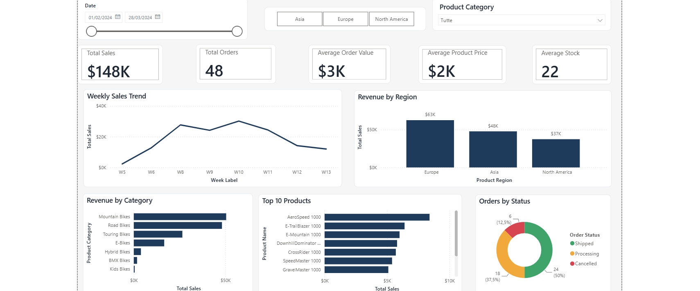

# Supply Chain & Sales Performance Monitor (Power BI)

Three-page executive dashboard built in Power BI Desktop on a retail orders dataset (bicycles): sales performance, customer analysis and supply chain operations.

## Business questions

- Where is revenue coming from, by region, category and product?
- Who are the top customers, where are they located, and how satisfied are they?
- Which orders are stuck in the pipeline and how much revenue is at risk?
- Is air shipping actually faster than ground, and by how much?
- Which products are overstocked (capital tied up) vs fast-moving (stock-out risk)?

## Report pages

**1) Executive Overview.** KPI cards (Total Sales, Total Orders, Average Order Value, Average Product Price, Average Stock), weekly sales trend, sales by region/category, top 10 products, order status breakdown. Status donut cross-filters the whole page.

**2) Customer Analysis.** Customer KPIs (customer count, revenue per customer, positive feedback rate), bubble map of customer locations, top 10 customers by revenue, orders & revenue matrix by country with data bars, payment method and feedback distribution.

**3) Supply Chain Analysis.** Operational KPIs (fulfillment rate, cancellation rate, average shipping days, air share, revenue at risk), order pipeline by status, shipping method volume vs average delivery days (combo chart), **stock vs units sold quadrant scatter** for inventory prioritisation (top-left = overstock, bottom-right = stock-out risk), inventory treemap by subcategory, category × status heatmap. The scatter is deliberately excluded from cross-filtering so it always shows the full inventory picture.

## Data model

- Single fact table `Sales` (48 orders, 24 columns)  sample dataset from a training context, kept intentionally small; the focus of this project is the modelling and design process.
- Dedicated DAX date dimension (`CALENDAR` over the order date range, week/month sort columns), auto date/time disabled.
- Single-direction 1:* relationship `Date[Date] → Sales[Order Date]`.
- Dedicated measure table `_Measures` with 20+ measures organised by area.

**Selected measures:** `Average Order Value`, `Cumulative Sales`, `Fulfillment Rate`, `Cancellation Rate`, `Revenue at Risk` (open orders exposure), `Lost Revenue` (cancelled orders), `Avg Shipping Days`, `Air Share %`, `Stock Coverage Ratio`, `Positive Feedback %`, plus ranking via `RANKX`. Patterns used: `CALCULATE` + boolean filters, `FILTER`/`ALL` cumulative pattern, `DIVIDE` for safe ratios, `DISTINCTCOUNT`.

## Data quality findings

Documented issues found while profiling the source, and how they were handled:

1. **Leading spaces in `Customer Location`** (e.g. `" USA"`) broke map geocoding → fixed with a Trim step in Power Query.
2. **`Estimated Delivery Date` is inconsistent** (year 2023 vs. 2024 order dates) → excluded from all calculations; `Shipping Time (in Days)` used instead.
3. **One order per customer** in this sample → retention/repeat-purchase analysis intentionally out of scope.
4. Only two months of orders (Feb–Mar 2024) → trend analysis is **weekly**, not monthly, to avoid a meaningless two-point line.

## Design

Consistent corporate navy/teal color palette with semantic colors across all report pages (green = shipped, amber = processing, red = cancelled). Clean executive layout with consistent typography, spacing, and visual interactions designed to improve readability and decision-making. KPI cards are excluded from visual interactions, while the Order Status donut chart acts as a page-level filter.

## Repository contents

| File | Description |
|---|---|
| `Orders Report.pbix` | Power BI report (data model, measures, 3 report pages) |
| `Sales.xlsx` | Source data (sheet `Sales`) |
| `screenshots/` | One PNG per report page |

## How to open

Power BI Desktop (free) → open `Orders Report.pbix`. To refresh the data, repoint the source to your local copy of `Sales.xlsx` via *Transform data → Data source settings*.

## Tools

Power BI Desktop · Power Query · DAX

---
*Built by Donald Pura as part of a Business Intelligence portfolio. Feedback welcome.*

